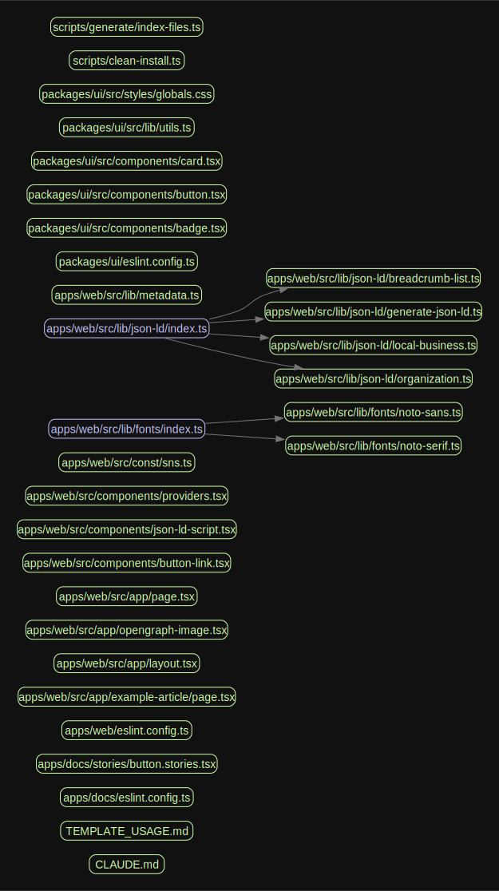

<div align="center">
  

# shadcn/ui Monorepo Template

[](https://nextjs.org/)
[](https://reactjs.org/)
[](https://www.typescriptlang.org/)
[](https://tailwindcss.com/)
[](https://turbo.build/repo)
[](https://pnpm.io/)

**English | [日本語](./README-ja.md)**

A modern monorepo template for shadcn/ui component libraries.<br />
Features Turborepo, pnpm workspaces, Next.js 15, React 19, and Storybook integrated for professional development.

  
  &nbsp;&nbsp;&nbsp;&nbsp;
  
  &nbsp;&nbsp;&nbsp;&nbsp;
  
  &nbsp;&nbsp;&nbsp;&nbsp;
  
  &nbsp;&nbsp;&nbsp;&nbsp;
  
  &nbsp;&nbsp;&nbsp;&nbsp;
  

### ✨ Feature Highlights

🚀 **Monorepo Architecture** - Fast builds with Turborepo + pnpm workspaces<br />
🎨 **shadcn/ui** - High-quality UI component library<br />
⚡ **Next.js 15** - Latest development environment with React 19 + Turbopack<br />
📚 **Storybook** - Component-driven development<br />
🛡️ **TypeScript** - Type-safe development<br />
🎯 **Full Testing** - Jest + Playwright + Testing Library

</div>

### 🚀 Quick Start

```bash
# Use this template
# Click "Use this template" → "Create a new repository" on GitHub

# Clone your new repository
git clone https://github.com/YOUR_USERNAME/YOUR_REPO_NAME.git
cd YOUR_REPO_NAME

# Install dependencies
pnpm install

# Start development servers
pnpm dev
```

**Access:**

- 🌐 Web App: http://localhost:3000
- 📚 Storybook: http://localhost:6006

## 🚀 Tech Stack

### Core Technologies

- **Turborepo** - Build orchestration & monorepo management
- **pnpm** - Fast package manager with workspace support
- **TypeScript** - Type-safe development environment
- **Node.js 22+** - Runtime requirement

### Frontend

- **Next.js 15** - React framework with App Router + Turbopack
- **React 19** - Latest React library
- **Storybook** - Component development & documentation
- **shadcn/ui** - High-quality UI component library
- **Tailwind CSS** - Utility-first CSS framework
- **Radix UI** - Accessible primitive components
- **next-themes** - Theme support
- **class-variance-authority** - Component variant management
- **lucide-react** - Icon library

### Development & Testing Tools

- **Jest** - Unit & integration testing
- **Playwright** - E2E testing
- **Testing Library** - React component testing
- **ESLint** - Code quality & style
- **Prettier** - Code formatting
- **Husky** - Git pre-commit hooks

## 📁 Project Structure

<details>
<summary>🗂️ <strong>View Full Project Structure</strong></summary>

```
📦 shadcn-starter/
├── 🌐 apps/
│   ├── 💻 web/                     # Next.js Web Application
│   │   ├── 📄 src/app/            # App Router pages
│   │   ├── 🧩 src/components/     # App-specific components
│   │   └── 🔧 src/lib/           # Utilities
│   └── 📚 docs/                   # Storybook Documentation
│       └── 📖 stories/           # Component stories
├── 📦 packages/
│   ├── 🎨 ui/                     # Shared UI Components
│   │   ├── 🧩 src/components/    # shadcn/ui components
│   │   └── 🔧 src/lib/          # Utilities
│   ├── 🧪 e2e-web/               # Playwright E2E tests
│   ├── ⚙️ eslint-config/          # Shared ESLint config
│   ├── ⚙️ typescript-config/      # Shared TypeScript config
│   └── ⚙️ jest-config/            # Shared Jest config
└── 🔨 scripts/                    # Build & utility scripts
```

</details>

### 🏗️ Architecture Overview

| Directory               | Description             | Tech Stack                         |
| ----------------------- | ----------------------- | ---------------------------------- |
| 🌐 **apps/web**         | Main Web Application    | Next.js 15, React 19, Tailwind CSS |
| 📚 **apps/docs**        | Component Documentation | Storybook 9.1                      |
| 🎨 **packages/ui**      | Shared UI Components    | shadcn/ui, Radix UI, CVA           |
| 🧪 **packages/e2e-web** | E2E Test Suite          | Playwright                         |
| ⚙️ **packages/config**  | Shared Config Packages  | ESLint, TypeScript, Jest           |

## 🛠️ Development Commands

### Basic Development & Build

```bash
# Start development servers (Web + Storybook)
pnpm dev

# Build all applications
pnpm build

# Preview built Storybook
pnpm preview-storybook
```

### Testing

```bash
# Run all tests
pnpm test

# Run tests by type
pnpm test:unit              # Unit tests only
pnpm test:integration       # Integration tests only
pnpm test:e2e              # E2E tests
pnpm test:all              # All test types
```

### Code Quality

```bash
# Run ESLint
pnpm lint

# Check file naming conventions
pnpm lint:ls

# TypeScript type checking
pnpm check-types

# Format with Prettier
pnpm format
```

### Version Management & Release

```bash
# Create changeset
pnpm changeset

# Update package versions
pnpm version-packages

# Publish packages
pnpm release
```

### Utilities

```bash
# Generate dependency graph
pnpm generate:graph

# Generate index files
pnpm generate:index

# Clean install dependencies
pnpm clean-install

# Update dependencies
pnpm update-deps
```

## 🎨 shadcn/ui Component Management

### Adding New Components

Add shadcn/ui components to the web application:

```bash
# Add individual components
pnpm dlx shadcn@latest add button -c apps/web
pnpm dlx shadcn@latest add card -c apps/web
pnpm dlx shadcn@latest add dialog -c apps/web

# Add multiple components at once
pnpm dlx shadcn@latest add button card dialog -c apps/web
```

Components are placed in `packages/ui/src/components/` and shared across the entire project.

### Using Components

```tsx
import { Button } from '@workspace/ui/components/button'
import { Card, CardContent, CardHeader } from '@workspace/ui/components/card'

export default function MyPage() {
    return (
        <Card>
            <CardHeader>
                <h2>Title</h2>
            </CardHeader>
            <CardContent>
                <Button variant="default">Click me</Button>
            </CardContent>
        </Card>
    )
}
```

## ⚙️ Technical Specifications & Requirements

### System Requirements

- **Node.js**: 22 or higher required
- **Package Manager**: pnpm@10.0.0+ (npm and yarn not supported)
- **Git**: Pre-commit hooks enabled

### Development Principles

- **TypeScript Required**: Zero type errors and ESLint errors policy
- **App Router Adoption**: No API Routes (use Server Actions instead)
- **Workspace Management**: Share configs and components via `@workspace/*`
- **Semantic HTML**: ARIA compliance for accessibility

### Code Style

- No semicolons, single quotes
- 80-character line limit, 2-space indentation
- Auto-sorted Tailwind classes and imports
- Required `cn()` function for className concatenation

## 📚 Development Guidelines

### Project Initialization

```bash
# Initial setup after cloning repository
pnpm install
pnpm prepare  # Enable Husky hooks
```

### Development Workflow

1. **Feature Development**: Start development server with `pnpm dev`
2. **Component Development**: Visual validation with Storybook
3. **Quality Check**: Run the following commands sequentially

```bash
pnpm check-types    # Type checking
pnpm lint          # ESLint
pnpm test          # Test execution
pnpm build         # Build validation
```

### Testing Strategy

- **Unit Tests**: `__test__/unit/` - Pure functions & utilities
- **Integration Tests**: `__test__/integration/` - Component integration
- **E2E Tests**: `packages/e2e-web/` - Using Playwright
- **Visual Tests**: Storybook - Component display & interaction

### Performance Optimization

- Prioritize Server Components, minimize `use client`
- Code splitting with dynamic imports & Suspense
- Appropriate use of memoization (useMemo/useCallback)
- Use `next/image` for images, `next/link` for links

## 🔗 Dependency Graph

Visualize project dependencies with the following command:

```bash
pnpm generate:graph
```


